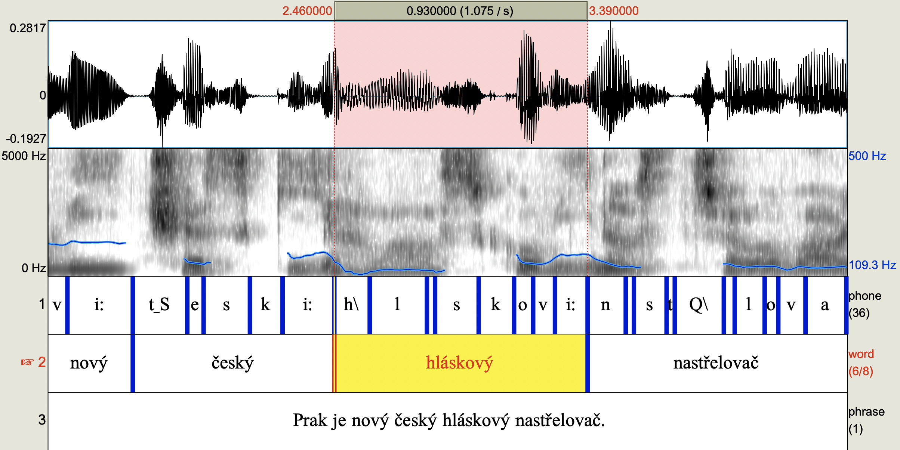

# prak: Czech phonetic alignment tool

[Slides from Prak presentation at FnUK/FU Nov 8th 2022](https://github.com/vaclavhanzl/presentations/raw/main/prak/Prak.pdf)

[](https://github.com/vaclavhanzl/prak/wiki/Presentations-about-Prak)


## I just want it, now!
OK. Get **prak** source code and python3.10 with pytorch and torchaudio. Record wav, make phrase
tier with text and **prak** will find phone and word times: 
```
prak -i pocasi.textgrid -w pocasi.wav -o pocasi.out.textgrid
```

Enjoy!
## Well, not so fast. Explain it all nicely.
Given a Czech voice recording and corresponding text transcript, this tool can guess a sequence
of phones and their position in time.

Design goals:
* Fully opensource, avoiding dependencies which would restrict academic and/or comercial use in 
any way. Original code was written for this project from scratch to avoid any legal limits and
allow others to continue this work.
* Usable on Linux, Mac and Windows.
* More precise than similar tools, specifically targeting needs of the Czech phoneticians.

## Installation on Windows
Go to [mambaforge](https://mamba.readthedocs.io/en/latest/installation.html), download mambaforge for windows ([Mambaforge-Windows-x86_64](https://github.com/conda-forge/miniforge/releases/latest/download/Mambaforge-Windows-x86_64.exe)). Run it, despite any protests from Windows (it will whine about unknown application, click small text 'more information' and then 'Run anyway'). Install to ```C:\mambaforge```. This location is the only thing you have to change, otherwise go with default settings in installation dialogs.

Run mambaforge console. Should be in Start menu as "Miniforge console" (name of the window is "Miniforge Prompt"). Text prompt must start ```(base)```. (If it does not, you ran something else. Find the right one.) Type this (and hit Enter):
```
mamba install pytorch torchaudio -c pytorch
```
and then this (then Enter again):
```
pip install pysoundfile
```
If any Y/n questions pop up, just hit Enter (or type Y and Enter if you wish).

**Download [prak zip file](https://github.com/vaclavhanzl/prak/archive/refs/heads/main.zip)** (zip also available from green "Code" button up right on this GitHub page, download zip.). Uncompress it directly to ```C:\``` (or uncompress and move there), creating ```C:\prak-main``` folder. **Rename this folder to ```C:\prak```**.

Run praat. Open script ```C:\prak\prak_align_phrase.praat``` and add it to menu (File > Add to dynamic menu > Class1: Sound, Class2: TextGrid, Command: Align using prak).

Set Praat **text files encoding to UTF-8** (Praat > Preferences > Text reading preferences > UTF-8, then Text writing preferences > UTF-8).

Refer to [Prak installation details](https://github.com/vaclavhanzl/prak/wiki/Prak-installation-details) if you need to know more.

## Installation on Mac
Go to [mambaforge](https://mamba.readthedocs.io/en/latest/installation.html).
Choose and download the installation file [here](https://github.com/conda-forge/miniforge#mambaforge), either
[Mambaforge-MacOSX-x86_64](https://github.com/conda-forge/miniforge/releases/latest/download/Mambaforge-MacOSX-x86_64.sh)
for older Intel-based Macs or
[Mambaforge-MacOSX-arm64](https://github.com/conda-forge/miniforge/releases/latest/download/Mambaforge-MacOSX-arm64.sh)
for new Macs with Apple M1 chips. Then make the downloaded file executable (using chmod) and run it in the terminal, for example (for Intel Mac):
```
chmod +x Downloads/Mambaforge-MacOSX-x86_64.sh 
Downloads/Mambaforge-MacOSX-x86_64.sh
```
Answer a few questions (likely **yes** or just Enter but you must explicitly type **yes** where needed). If the licence agreement is too long to show, press spacebar untill you reach the end, then agree (yes). After installing mambaforge successfully, QUIT TERMINAL COMPLETELY and run it again. The prompt will now start with "(base)" and you can install python packages we need:
```
mamba install pytorch torchaudio -c pytorch
```

Get **prak**, preferably using **git** (makes future updates super easy):
```
git clone https://github.com/vaclavhanzl/prak.git
cd prak
```
(Or you can get zip as described above for Windows and uncompress it in your home folder.)

Run praat. Open script ```C:\prak\prak_align_phrase.praat``` and add it to menu (File > Add to dynamic menu > Class1: Sound, Class2: TextGrid, Command: Align using prak). Set read/write to UTF-8 (Praat > Preferences > Text reading preferences > UTF-8, then Text writing preferences > UTF-8).

Refer to [Prak installation details](https://github.com/vaclavhanzl/prak/wiki/Prak-installation-details) if you need to know more.


## Installation on Linux
Things happen too fast in the python world for apt package managers to keep up. So you most likely want a special package manager just for python, and there are really great tools to choose from.

For scientific work, **conda** package manager might be better than **pip**. In the conda world, there are still many options.
You likely do not want the huge Anaconda but rather the more free and modular conda forge. To get it working, you still have 
multiple options from which [**mambaforge**](https://mamba.readthedocs.io/en/latest/installation.html) (faster conda) looks quite good. With this general guidance, it is now easy to google your way.

Big part of pytorch installation complexity stems from the CUDA GPU drivers installation.
If you do not plan training big neural networks or do not have a decent GPU, you may very well
use pytorch just on the CPU. **Prak** only uses CPU for phone alignment and even acoustic model
can be reasonably trained on just the CPU.

You need ```pytorch``` and ```torchaudio``` packages. As a linux hacker you likely have other things to do with python so **prak** tries to use its own virtual environment ```prak``` before resorting to ```base``` or even trying to run without a virtual environment
(this logic is in [prak/prak](https://github.com/vaclavhanzl/prak/blob/main/prak)). Prepare it like this:
```
mamba create prak
mamba activate prak
mamba install pytorch torchaudio -c pytorch
```

Get **prak** source code via git. If you have a GitHub account and ssh key, clone directly from your home like this:
```
git clone git@github.com:vaclavhanzl/prak.git
cd prak
```
otherwise resort to https:
```
git clone https://github.com/vaclavhanzl/prak.git
cd prak
```

Then run **praat** and add ```prak/prak_align_phrase.praat``` to menu, the same way as described above for Mac.
If you did not put **mamba** or **prak** directly to your home directory, edit config variables in this script.

Refer to [Prak installation details](https://github.com/vaclavhanzl/prak/wiki/Prak-installation-details) for even more details.

## Usage
### Align from praat GUI
Select sound and textgrid containing phrase tier, press your new **Align using prak** button.
You can also align multiple sounds using multiple textgrids, or multiple sounds using one input textgrid for all.
Some details:

* text can be in one or more intervals of tier named "phrase" or "Phrase"
* if input textgrid does not contain tier with such name, prak will nicely let you choose the right one
* times of the text tier do not have to match the audio so you can align several wavs using one textgrid
* text can contain all the usual interpunction (if it is human readable, prak will likely process it, too)
* text is expected to be utf-8 NFC but prak can deal with problems like [BOM, NFD or CRLF](https://github.com/vaclavhanzl/prak/wiki/Text-encoding)
* prak automatically matches selected wav(s) and textgrid(s) and either goes on automatically if it makes clear sense or asks you for details if needed
* if the textgrid contains a phone tier, prak warns you before going on to safeguard any manual tuning you already did 
* sound can have any sampling frequency
* several pronunciation variants are considered where there is possible ambiguity and the (hopefully) right one is selected based on acoustic signal match
* you can specify your own [exceptions for foreign words](https://github.com/vaclavhanzl/prak/wiki/Exceptions-for-foreign-words)
* phone tier created by prak uses [SAMPA](https://github.com/vaclavhanzl/prak/wiki/Phone-symbols) phone codes

Most of the phone-phone boundaries will likely still need manual microtununig to suit your needs but not much more than that. On the level of words (and silences present or not present between words), alignment should be mostly correct. Prak tries its best to decide whether voicing assimilation happened or not on word boundaries, whether glottal stop is present, whether some possible phone changes happened or not etc. Often it is right, sometimes the decision is hard even for a human. Sometimes prak gets these things wrong but it should be a minority of cases.


### Align from command line
For alignment with audio, you will need a Czech voice recording (wav) and a corresponding Czech transcript (in phrase tier in an utf8 TextGrid).
The transcript can contain usual punctuation (as a secretary would transcribe it) but should be precise even at
disfluencies - if the recording contains a repeated word, so should the transcript. If you used **praat** to
make a phrase tier with transcript and saved it to file ```pocasi.textgrid```, you can use **prak** to guess
pronunciations and time align all phones and words. Run this in terminal:
```
~/prak/prak.py -i pocasi.textgrid -w pocasi.wav -o pocasi.out.textgrid
```
The **Align using prak** button is in fact using this method internally to do its magic.

### Generate only pronunciations
To get an idea about pronunciation variants being considered, run this first (being in the **prak** folder):
```
prongen/prak_prongen.py
```
The tool will nicely help you. To see generated Czech pronunciation, try this:
```
prongen/prak_prongen.py -p -s
```
or, if you are on Mac or Linux or you somehow got a real terminal in Windows, try much nicer
```
prongen/prak_prongen.py -p
```
and then type Czech sentences in terminal (finish each with Enter, press Ctrl+D to stop).
(Look at [prongen/README.md](prongen/README.md) for details.) If this works, **python** is installed OK.


Multiple pronunciation variants are considered, the acoustic model will hopefully choose the right
one. You may need to teach the tool some additional foreign words or tell it about important seams in composite
words. Just edit the [prak/exceptions.txt file](https://github.com/vaclavhanzl/prak/blob/main/exceptions.txt).
It is automatically used at this default location by the GUI method and you can also use it from command line
using the ```-e``` option.


## Prak updates
If you used **git** to download **prak**, it is easy. Go to the **prak** folder and run:
```
git pull
```
If you went with the zip option, download a new zip the same way.

You certainly want to update, prak is getting better nearly daily! See recent [list of published changes](https://github.com/vaclavhanzl/prak/commits/main) or even [what happens in the develop branch](https://github.com/vaclavhanzl/prak/commits/develop) (extremely courios ones can even see feature branches).
We are currently testing and tuning installation for all the platforms so also this README is still changing quickly.

## Speed
1 minute audio was phone-aligned in 18 seconds on a 2014 Mac Air, in 3.6 seconds on a 2020 M1 Mac Air, in 5 seconds on a decent 2020 Intel linux box.

## Training data
The acoustic model was trained solely on the Czech [CommonVoice](https://commonvoice.mozilla.org/en/datasets) recordings.
I am also immensly grateful to [Fonetický ústav FFUK](https://fonetika.ff.cuni.cz/) for the possibility to compare
their hand labeled (and phone-level time aligned) data with prak's automatic labeling, this helps a lot. However, training
of the prak's acoustic model currently does not involve any hand-aligned data. (CommonVoice data consist of recorded sentences with
corresponding ortographic transcriprion. No human-decided time alignment on the level of words or phones is used for training,
these alignments are purely machine made.)

## About the name
Some Czech phonetitians call similar tools "nastřelovač" as these tools position phones and their time stamps
in a fast but rather unprecise manner, like positioning objects by shooting them where they should be.
The Czech word "prak" means "sling", a common shooting toy.

## Can I contribute to prak?
Of yourse! You are welcome! You can contribute in many ways:
* Try to install and use prak and [report any issues](https://github.com/vaclavhanzl/prak/wiki/Reporting-bugs), e.g. in [Discussions](https://github.com/vaclavhanzl/prak/discussions). Use version from the [**develop**](https://github.com/vaclavhanzl/prak/tree/develop) branch to help with tests of the latest changes.
* [Become a developer](https://github.com/vaclavhanzl/prak/wiki/Developer's-guide)
* Add pronunciations of foreign words or help for harder Czech words, like composed Czech words with vowel after seam.


## Discussions and Contact
You can discuss prak in public here in [Discussions](https://github.com/vaclavhanzl/prak/discussions).
If you want to tell me more personally that you love this or hate this, message @vaclav512 on Twitter.

## Thanks
I'd like to thank all the nice people from [Fonetický ústav FFUK](https://fonetika.ff.cuni.cz/) and equally nice young people from [FňUK](https://www.facebook.com/profile.php?id=100057425272524) who inspired me by their charming approach to science and life.
