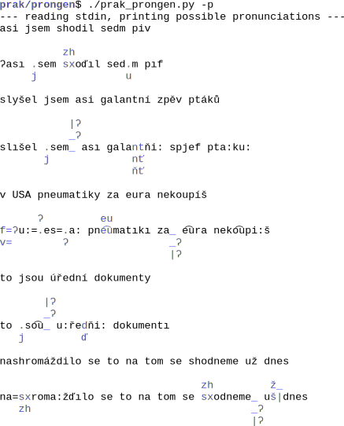

## How pronunciation generator works
This tool was made to help phoneticians and therefore it tries to capture any logic (as far as it exists)
in the Czech pronunciation and really make it right. There are more pragmatic approaches, for example one
may generate long list of examples and train one of the proven pronunciation generation tools on these,
or write some 350 search/replace rules and solve pronunciation with these, or just make long enough
pronunciation lexicon by hand. Any of these is sufficient to make a good ASR because e.g. triphone models
can absorb and fix significant errors in the pronunciation layer and modern NN systems even ignore the
concept of anything like phones or phonemes.

With this tool, we took the painful way of searching for logic in the language. To a certain degree, this
works for things like Czech voiced/voiceless assimilations and can even do a better job than
autolearned rules as the assimilation dependencies can be quite long range sometimes. For pronunciation
of "slightly foreign" words, we made list of examples and automatically learned good rule set for
pronunciation of ditini/dytyny. And for the rest, we tried to make it easy for the user to add hand-made
rules.

As this tool was designed specifically for time alignment, we preffered generating multiple pronunciation
variants whenever there is even a slight chance for these - acoustic model can select among variants.
On the other hands, we tried to allow variants only where it makes sense - for example, at the meeting
point of two words, there are multiple possibilities for voiced/voiceless variant of word's end, there
may or may not be an intervening space and the second word could possibly start with a glottal stop
(or not) if it starts with a vowel. Not all combinations make sense and we try to allow only those which
do. By weeding out the nonsense combinations, we hope to create a more capable acoustic models even for
problematic elements like the glottal stop or voiced alophone of the Czech "ch". (These things have no
sure occurences marked in the Czech ortography so we must carefully guide the learning process for these.)

The overall structure of the pronunciation variants generator is roughly as follows:
* clean up punctation marks
* lowercase the text
* connect short prepositions to words
* treat foreign words using hand-made string replacement rules and learned (on hand-made examples) rules for ditini/dytyny, also guess some important seams in composed words
* care for few forward assimilations (mostly for "ř" and initial "sh")
* do bulk of the "logical" work in a system of backward assimilations (each of the parts is in fact a Finite State Transducer with a very limited state set - backward direction makes these FSTs much simpler or even possible at all):
  - expansion of "multiphone" h/ch created in the forward assimilation step above
  - glottal stop insertion, insertion of "j" in vocalic groups like "io"
  - voiced/voiceless assimilations
  - dtn/ďťň processing in groups like "ntní", processing of bě/pě/vě/mě/fě
  - velarization in nk/ng
* optionally merge some phones (e.g. doubled ones) by coarticulation rules. (For technical reasons, this step is in fact done before the preceding "logical" step.)
* optimize the resulting graph of possibilities so as it can be presented in a human readable way

## Example output

## Automatic rules for "ditini"
To aid our acoustic model training, all the words from CommonVoice train subset were included in training of the "ditini" ruleset. Pronunciation should be nearly 100% correct for these words. Approx. 98% accuracy can be expected for other words.

## Where hand made rules may be needed
* foreign words which kept ortography and pronunciation not corresponding to Czech rules
* abbreviations
* insertion of a glottal stop at seam of composite words (where the second part starts with a vowel)

## How pronunciation rules work
Order of rules is mostly not important. Priority is governed by the length of a string to be replaced (possibly by multiple options for the replacement string). Word is compared against the whole ruleset and the longest match is replaced. The part of word which is replaced is never touched by other pronunciation rules. However, the preceding and following part are searched for any additional replacements by rules matching shortes substrings.
